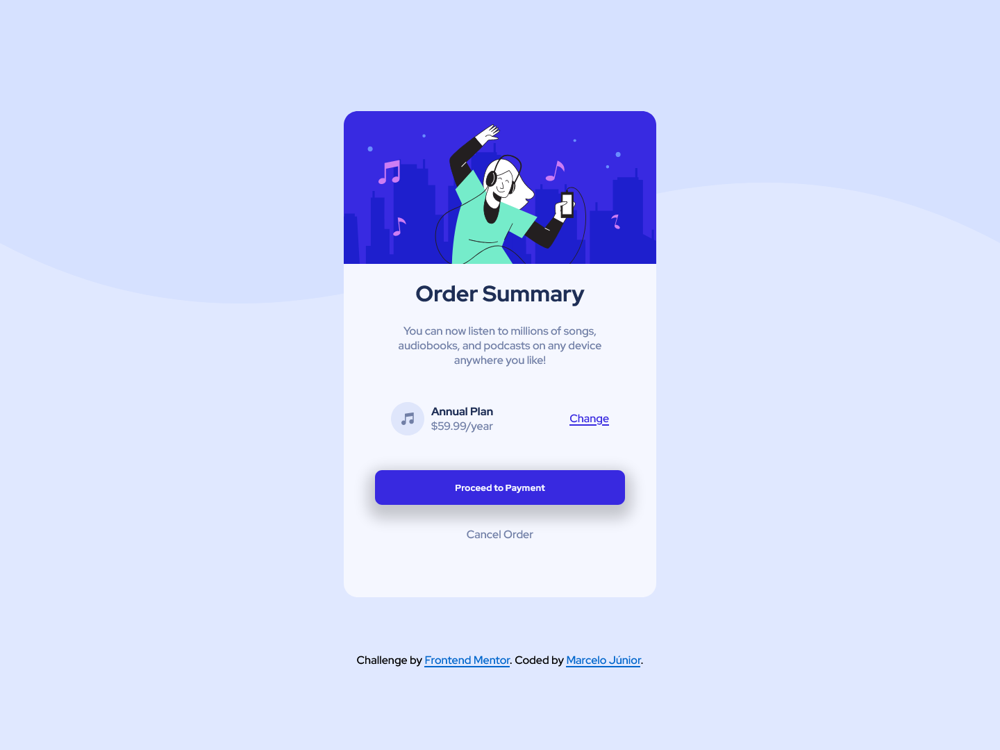

# Frontend Mentor - Order summary card solution

This is a solution to the [Order summary card challenge on Frontend Mentor](https://www.frontendmentor.io/challenges/order-summary-component-QlPmajDUj). Frontend Mentor challenges help you improve your coding skills by building realistic projects. 

## Table of contents

- [Overview](#overview)
  - [The challenge](#the-challenge)
  - [Screenshot](#screenshot)
  - [Links](#links)
- [My process](#my-process)
  - [Built with](#built-with)
  - [What I learned](#what-i-learned)
  - [Continued development](#continued-development)
  - [Useful resources](#useful-resources)
- [Author](#author)
- [Acknowledgments](#acknowledgments)

**Note: Delete this note and update the table of contents based on what sections you keep.**

## Overview

Challenge made by Frontend Mentor, coded by Marcelo Júnior.

### The challenge

Users should be able to:

- See hover states for interactive elements

### Screenshot

### Links

- Solution URL: 

## My process

-I started building the HTML5, then I´ve implemented the CSS custom properties, along with the flexbox, to make it easier to center things.

### Built with

- Semantic HTML5 markup
- CSS custom properties
- Flexbox

### What I learned

- I didn´t know much about flexbox and his properties, It definitely help me to understand how to use it, and when to use it.

### Continued development

I am a beginner at programming, especially in Frontend, however I loved coding this project, and I really want to improve my skills, and learn more every day.

## Author

- Github - [Marcelo Júnior](https://github.com/marcelo-jrs)
- Frontend Mentor - [@marcelo-jrs](https://www.frontendmentor.io/profile/marcelo-jrs)
- Twitter - [@marcelin_jrs](https://twitter.com/marcelin_jrs)
